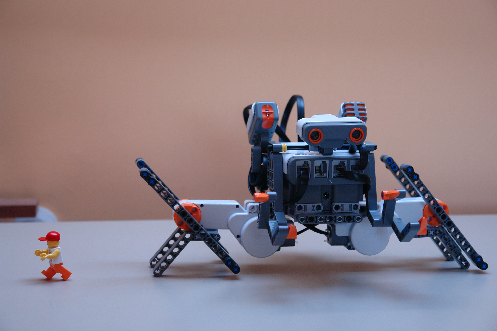

# The Lego Mindstorm NXT Crab Robot
A Lego Crab Robot created with Lego NXT Mindstorm

This robot was created more than 10 years ago, when I was an newbie in the world of Robotics and my parents finally gift me my dreamed NXT Kit robot. Unfortunally I didn't created a building guide, but viewing the photos is easy to recreate the robots without problems.

You have the original code at the file "cangrejo.c"

A little video of the robot:

Enjoy!
***

The robot was created for a small contest of the Shop [Electribricks](https://www.electricbricks.com)

***

 Lego Crab Robot by Julián Caro Linares licensed by <a rel="license" href="http://creativecommons.org/licenses/by-sa/4.0/">Creative Commons Attribution-ShareAlike 4.0 International License</a>.  
